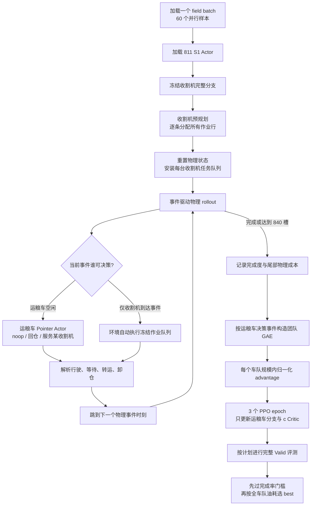

# 当前 Stage 2 训练、异构策略网络与环境实现说明

> **范围声明：** 本文记录的是另一套 IA 农机环境（收割机/运粮车）的参考实现，
> 不是当前 HKBZ 飞机保障 Stage 2 的代码契约。HKBZ 不拆分 encoder，也不存在
> 本文的收割机预规划、物理油耗目标或 840-event horizon。当前可执行口径以
> [TWO_STAGE_TRAINING.md](TWO_STAGE_TRAINING.md) 和
> `onpolicy/config/env_resource_joint.yaml` 为准。
>
> 实现快照：2026-08-11 当前工作树
> 运行口径：当前保留的 Raw-c（油耗单目标）正式实验
> canonical 阶段：`curriculum_stage=2` / `stage2_transporter_event_learning`

## 1. 结论摘要

当前 S2 的本质不是“两类智能体一起学习”，而是：

1. 从 811 版本的 S1 checkpoint 精确恢复收割机策略；
2. 用该冻结策略先为整块田生成一份完整的收割机作业序列；
3. 重置物理状态并执行该固定作业序列；
4. 正式 rollout 中只有运粮车产生可训练决策；
5. 以全局事件为时间轴，用团队级 GAE 和 PPO 更新运粮车独立网络；
6. 以近 100% 完成率为硬可行性门槛，在可行模型中最小化全车队物理油耗。

最容易误解的几个事实如下：

- S2 是纯事件驱动，`episode_length=840` 表示最多 840 个离散事件槽，不是 840 秒，也不是固定周期决策。
- 收割机和运粮车现在不共享 encoder；两类智能体拥有相互独立的图 GNN、车辆编码器、序列编码器、Actor 和 Critic。
- 收割机分支保留 811 的 5 维输入和原始网络计算，并在 S2 全程冻结；运粮车分支使用完整 10 维异构状态。
- 正式 rollout 的 Actor/GAE 样本只有运粮车。收割机在环境内根据预生成任务自动运行，不参与 S2 PPO 更新。
- 当前 Raw-c 训练 reward 只包含运粮车真实物理油耗；模型选择时报告并比较的是全车队物理油耗。
- 完成率没有混进普通逐步 reward，而是通过按车队规模维护的终局对偶惩罚进入最后一个团队事件。
- `use_constrained_rl=False` 不代表没有完成率约束；当前完成率约束由 fleet dual 路径单独实现。

## 2. 当前阶段定义与命名

当前代码已将旧的四阶段流程压缩为三阶段：

| 阶段 | 当前含义 | 时钟 | 可训练角色 | 网络结构 |
|---|---|---|---|---|
| S1 | 收割机事件驱动学习 | event | 收割机 | `legacy_v811` |
| S2 | 冻结收割机、训练运粮车 | event | 运粮车 | `dual_v811_harvester_transporter_v3` |
| S3 | 两角色联合微调 | event | 收割机与运粮车 | `dual_v811_harvester_transporter_v3` |

阶段契约定义在 [train_ia.py](../../onpolicy/scripts/train/train_ia.py) 的 `STAGE_SPECS` 中。S2 的强制契约是：

```text
pipeline_stage = stage2_transporter_event_learning
clock_mode     = event
return_mode    = global_event_team
reward_mode    = physical_fuel（当前 Raw-c）
learn_harvester = False
policy_architecture = dual_v811_harvester_transporter_v3
```

### 2.1 历史文件名与当前阶段名

部分脚本和工具仍保留 `direct_stage3`、`stage3_*` 等历史命名。这不表示当前仍在训练旧 S3：

- 当前入口 [train_ia_stage2.sh](../../onpolicy/scripts/train_ia_stage2.sh) 只是转发到历史文件 [train_ia_direct_stage3.sh](../../onpolicy/scripts/train_ia_direct_stage3.sh)；
- 后者实际固定传入 `--curriculum_stage 2`、`--fix_harvester`、`--clock_mode event` 和 `--return_mode global_event_team`；
- 因此判断阶段应以保存到 `config.json` 的 `curriculum_stage` 和 `pipeline_stage` 为准，不能只看文件名。

## 3. 端到端执行链路



一次训练 epoch 的实现顺序位于 [ia_runner.py](../../onpolicy/runner/shared/ia_runner.py) 的 `run()`：

1. 设置当前 epoch 的超参数和冻结状态；
2. 对 150 个 field batch 依次执行 `warmup → rollout → compute returns → PPO update`；
3. epoch 结束后按计划进行全量 Valid；
4. 保存 epoch、评测、fleet dual 和 checkpoint 元数据。

## 4. 数据、车队与并行批次

### 4.1 样本使用真实车队规模

当前使用 `fleet_size_mode=sample`，不会再把所有样本估计或裁剪成固定 3H1T。环境直接读取每个样本的 `car_cfg.pkl`，按 `tt` 做稳定分区：

- `tt=0`：收割机；
- `tt=1`：运粮车；
- 张量排列始终为全部收割机在前、全部运粮车在后；
- 样本车辆数超过 `max_agent_num=8` 时直接报错，拒绝静默截断；
- 每个样本必须同时包含两类车辆。

原生车队规模为：

```text
2H1T, 3H1T, 4H2T, 5H2T, 6H2T
```

数据又分为 `Task_md`、`Task_1depot`、`Task_1end` 三个 family，因此共有 `5 × 3 = 15` 个分层单元。

### 4.2 当前数据量和 field batch

| split | 每个 family | 三个 family 合计 | 每个 stratum |
|---|---:|---:|---:|
| Train | 3000 | 9000 | 600 |
| Valid | 300 | 900 | 60 |

当前训练使用 60 个 rollout 进程。分层切分为：

```text
60 threads / 15 strata = 每个 stratum 4 个专属进程
600 samples / 4 threads = 每个进程每 epoch 150 个样本
```

所以每个 epoch 有 150 个 field batch；每个 batch 同时推进 60 个环境。理论最大原始槽数为：

```text
150 × 60 × 840 = 7,560,000 slots / epoch
```

实际环境步数通常更少，因为完成的 episode 会提前结束；ReplayBuffer 仍补零到固定 840 槽，以保持 PPO 张量形状稳定。

## 5. S2 的初始化和训练逻辑

### 5.1 811 checkpoint 的角色

当前初始化 checkpoint 为：

```text
onpolicy/scripts/results/IA/simple/esb_gnn_mappo/
20260729-current-lae-r96-reproduction-r2-current_lae-seed14142135/
run1/models/best_model.pt
```

其来源是 S1/811 收割机训练，默认 SHA256 审计值为：

```text
724738ded25f4eddc603d3930d60451f2c749f27f32468300d9806dfa1d9c80c
```

加载模式为 `warmstart_actor`，含义是：

- 加载 Actor 相关表示和策略权重；
- 不恢复旧 optimizer；
- 不恢复旧 ValueNorm；
- 不加载旧 Critic，S2 的 Critic 从新初始化；
- 运粮车温度从当前 S2 配置重新初始化为 `tau=0.5`；
- 收割机预规划临时切回 checkpoint 对应的 `tau=0.46`。

### 5.2 收割机必须精确兼容

S2 恢复时，以下收割机模块必须与 811 tensor/layout 完全一致：

```text
encoder
sel_enc
actor
critic（warmstart_actor 下不实际载入，但结构仍受契约约束）
```

对于收割机 Actor 路径，任何 shape adaptation、缺失 tensor 或未映射 tensor 都会导致启动失败。因此 S2 的收割机不是“兼容性近似加载”，而是精确的 811 网络结构和权重。

### 5.3 运粮车如何从 S1 初始化

S1 checkpoint 没有独立运粮车模块，因此采用语义 fallback：

- `transporter_encoder` 从 S1 的 `encoder` 初始化；
- `transporter_sel_enc` 从 S1 的 `sel_enc` 初始化；
- `transporter_actor` 中能对齐的 query/attention/pointer 权重从 S1 Actor 初始化；
- 运粮车车辆输入由 5 维扩为 10 维：前 5 列复制 S1 权重，新增动态特征列置零；
- `noop` 和 `depot` 的两个特殊 action embedding 在 S1 中不存在，初始化为零；
- 随后这些运粮车参数全部可训练。

这是一种“结构化 warm start”，不是已经训练好的运粮车策略。尤其在初始时刻，新增动态特征还没有非零线性权重，两个特殊动作也没有从 S1 获得语义区分。

### 5.4 收割机预规划

每次环境 reset 后，S2 先进入 `preplanning_active=True`：

1. 只有空闲收割机的 `actor_valid_mask=True`；
2. 冻结的 811 Actor 逐步选择“作业行 + 进入方向”；
3. 已分配的行立即从可选集合中屏蔽；
4. 直到每条 working line 恰好分配一次；
5. 保存每台收割机的有序任务队列；
6. 重新创建车辆状态、把物理时钟归零，再开始正式执行。

训练预规划使用随机采样，评测预规划使用确定性 argmax。完整评测还会按样本路径缓存确定性的收割机计划，避免同一 checkpoint/样本反复计算。

因此，S2 固定的是“收割机策略参数和该次 rollout 的作业队列”，并不是把收割机物理轨迹完全预先写死。其实际到达、等待和被服务时间仍会受运粮车动作影响。

### 5.5 正式 rollout

正式执行开始后：

- 收割机到达可用事件时，环境自动取任务队列的下一项并执行；
- 运粮车到达可用事件时，策略网络选择 dispatch 动作；
- `actor_valid_mask` 只对空闲且可决策的运粮车为真；
- 仅收割机发生状态变化、而没有运粮车决策的 raw step 不构成 PPO 决策事件；
- 多台运粮车在同一物理时刻空闲时，构成同一个团队决策事件。

达到 840 个 raw event slots 后仍未完成时，Runner 先执行确定性的 terminal drain，补记由返仓、卸仓等尾部动作产生的真实油耗，然后记录策略在 horizon 上的完成度。当前 `use_fallback_completion=False`，不会用启发式策略替模型完成剩余作业。

## 6. 两种异构智能体的策略网络

网络契约由 [stage_architecture.py](../../onpolicy/algorithms/gnn_mappo/algorithm/stage_architecture.py) 和 [ac.yaml](../../onpolicy/config/ac.yaml) 定义，主实现在 [gnn_actor_critic.py](../../onpolicy/algorithms/gnn_mappo/algorithm/gnn_actor_critic.py)。

### 6.1 总体结构

| 项目 | 收割机 H | 运粮车 T |
|---|---|---|
| 车辆输入维度 | 5 | 10 |
| 可观察车辆 | 只看真实收割机，屏蔽运粮车 | 看完整异构车队 |
| 图 GNN | 独立、811 兼容 | 独立、可训练 |
| edge-attention Pre-LN | 关闭 | 开启 |
| SelectionEncoder | 独立 GRU | 独立 GRU |
| Actor | `PtrEntryActor` | `PtrActor` |
| 动作 | 作业节点 × 2 个进入方向 | noop / depot / 选择一台收割机 |
| Critic heads | s、t、c | s、t、c |
| S2 状态 | 全冻结、eval mode | Actor 表示和 c Critic 可训练 |
| S2 正式 rollout | 不产生学习样本 | 产生全部学习样本 |

`share_role_gnn=False`，所以两类角色连图 GNN 也不共享。训练运粮车不会通过共享 encoder 改写收割机策略。

### 6.2 通用图和车辆编码器

两条分支都使用 `MaGNNEncoder`，但参数完全分开。主要配置为：

```text
embed_dim = 64
activation = ReLU

图节点原始维度 = 3
图边原始维度 = 4
节点/边 embedding MLP = 2 层
edge self-attention heads = 4
TransformerConv = 8 层，4 heads
dropout = 0.1
每层节点更新 = residual + LayerNorm

车辆 embedding MLP = 2 层
车辆 self-attention = 2 层，4 heads
车辆到图节点 cross-attention = 4 heads
```

编码顺序如下：

1. 节点与边特征映射到 64 维；
2. 对同一图内的边做 multi-head self-attention；
3. 边经过 residual、LayerNorm 和前馈块；
4. 经过 8 层带 edge feature 的 `TransformerConv`；
5. 对图节点分别做 mean/max pooling，映射为 64 维全局图表示；
6. 对车辆特征做 embedding 和 self-attention；
7. 每台车以自身表示查询图节点；
8. depot 可见性受限：每台车只看自己的 start/end depot 节点，不看其他车辆的 depot；
9. 对真实车辆做 mean/max pooling，得到 64 维全局车队表示。

实际运行配置中，运粮车分支在 edge attention 之前执行 Pre-LayerNorm，收割机分支不执行，以保留 811 计算路径。`gnn.py` 中“Pre-LN 只属于 Stage4”的旧注释已经与当前三阶段重编号不一致，应以 `stage_architecture.py` 的实际配置为准。

### 6.3 收割机分支

收割机只消费 observation 的前 5 个特征：

```text
[vw, vv, cw, cv, tt]
```

同时屏蔽所有运粮车行，复现 S1 的同构收割机观察合同。它由以下模块组成：

```text
encoder  : MaGNNEncoder(veh_dim=5, 811 graph path)
sel_enc  : SelectionEncoder(input_dim=66, hidden=64)
actor    : PtrEntryActor(query_dim=256, heads=4)
critic   : StepCritic[s, t, c]
```

`SelectionEncoder` 的输入是 `64 维已选节点 + 2 维方向 one-hot`，经过 MLP、单层 GRU、残差前馈和 LayerNorm，形成 64 维序列状态。

Actor query 为四个 64 维向量拼接：

```text
全局车队表示 + 全局图表示 + 当前序列表示 + 当前车辆表示 = 256 维
```

`PtrEntryActor` 先选择作业节点，再为该节点选择 0/1 两个进入方向，最终分布大小为 `2 × 节点数`。S2 中它只在预规划阶段使用，并且临时使用冻结温度 `tau=0.46`。

### 6.4 运粮车分支

运粮车消费 10 个状态特征：

```text
静态 5 维：[vw, vv, cw, cv, tt]
动态 5 维：[grain_ratio, load_ratio, time_to_full,
            will_full_soon, waiting_unload]
```

这里是“完整车队矩阵”：每行仍按对应车辆角色填充。例如收割机行有 `grain_ratio`，运粮车行有 `load_ratio`。运粮车 encoder 不屏蔽收割机，因此能基于收割机装载率、预计停机时间和等待状态调度。

其模块为：

```text
transporter_encoder  : MaGNNEncoder(veh_dim=10, independent GNN, edge Pre-LN)
transporter_sel_enc  : SelectionEncoder(input_dim=66, hidden=64)
transporter_actor    : PtrActor(query_dim=256, heads=4)
transporter_critic   : StepCritic[s, t, c]
```

运粮车离散动作语义为：

```text
0       = noop
1       = 返回 depot 卸货
2 + h   = 调度到收割机 h
```

`PtrActor` 用两个可学习特殊 action embedding 表示 noop/depot，再拼接编码后的车辆表示作为候选 key。动作 mask 会把 `2 + num_harvester` 以后的无效区域全部屏蔽。

如果同一事件有两台运粮车同时决策，网络按车辆序号顺序生成动作：第一台选择某收割机后，该目标立即在本事件内被保留，后续运粮车不能重复选择；noop 和 depot 不做互斥。

### 6.5 H/T 序列状态隔离

同一 forward 中，收割机和运粮车各自维护一份 SelectionEncoder hidden-state bank。只有实际做出决策的角色会把对应 bank 写回 rollout RNN state。这防止新增的运粮车 recurrence 隐式改变 811 收割机的序列状态。

### 6.6 Critic 与参数归属

每个角色都有 s/t/c 三个 `StepCritic` head。Critic 使用相同的 256 维全局/局部 query 和候选 action keys，因此能看到图和车队的全局表征；它不是一个额外的单体 centralized-state 网络。

当前 `obj=c` 且 `mappo_train_all_critics=False`，所以有效训练目标是运粮车 `c` head。参数更新边界为：

| 参数组 | Actor step | Critic step | S2 是否变化 |
|---|---:|---:|---:|
| 收割机 encoder/GRU/Actor | 无梯度 | 不属于 critic optimizer | 否 |
| 收割机 Critic | 冻结 | 冻结 | 否 |
| 运粮车 encoder/GRU/Actor | 更新 | query/key 在 critic-only 时 detach | 是 |
| 运粮车 c Critic | 不属于 actor optimizer | 更新 | 是 |
| 运粮车 s/t Critic | 不参与当前单目标 loss | 不更新 | 否 |

Actor optimizer 对象在最初构造时可以持有两条 Actor 分支的引用，但冻结分支 `requires_grad=False` 且 Actor loss 只保留运粮车决策，因此 optimizer step 不会改变收割机 tensor。

运行 mode 还有一个精确细节：rollout 和 Actor 重算时整体网络处于 `eval`，因此图 GNN 的 `dropout=0.1` 不生效，但梯度仍会更新运粮车参数；Critic step 会切回 `train`，收割机分支仍被强制保持 `eval`，运粮车图表示带 dropout 后再与 Critic head 解耦。Critic optimizer 始终只拥有 value-head 参数。

## 7. 环境实现

环境外壳为 [environment.py](../../onpolicy/envs/IA/environment.py) 的 `FarmScheduleEnv`，异构调度和物理逻辑集中在 [hetro_swarm.py](../../onpolicy/envs/IA/scenario/hetro_swarm.py) 的 `HeterogeneousTaskScenario`。

### 7.1 车辆状态

每台车维护：

- 角色、原始配置、容量；
- 任务队列、是否完成、`next_free_time`；
- 当前作业行、进入方向、行内进度、道路端点和朝向；
- 收割机 grain、运粮车 load；
- 收割机等待卸粮状态与累计等待时间；
- 动态/静态服务次数、回仓次数、低载回仓次数、无进展事件数；
- transfer/work/service 时间；
- transfer/work 距离；
- `total_cost`、`physical_cost` 和逐目标增量 reward。

### 7.2 Observation 和图节点对齐

单车 observation 共 12 维：

```text
5 个静态特征
+ 5 个动态特征
+ 当前图节点索引
+ 方向
= 12
```

不足 `max_agent_num=8` 的车辆槽补零。图节点动作布局为：

```text
[0, M)       每台车的 start depot
[M, 2M)      每台车的 end depot
[2M, ... )   working lines
```

其中 `M=样本真实车辆数`。环境会对数据中的 PyG 图复制、删除或重排 depot 节点，使其严格对齐当前样本的 `2M` depot 动作布局；图张量容量上限为 700。

收割机预规划 observation 的方向使用 811 合同中的 `last_exit_dir`；运粮车 observation 使用当前物理位置的 entry 方向。

### 7.3 Mask 语义

环境显式返回：

```text
agent_exists_mask
role_mask / role_ids
ready_mask
actor_valid_mask
available_actions
```

需要特别注意历史兼容语义：

- `active_agents=True` 实际表示“没有 Actor 决策”；
- `available_actions=True` 实际表示“该动作不可用/需要屏蔽”；
- Policy 将两者转换成 PyTorch padding mask；
- ReplayBuffer 中真正的决策 mask 是 `active_masks < 0.5`。

预规划阶段 `actor_valid = ready ∩ harvester`，正式 S2 阶段 `actor_valid = ready ∩ transporter`。

### 7.4 事件时钟

构造器会拒绝任何 `decision_dt>0`；当前 S1-S3 只能使用纯事件时钟。每次处理完当前空闲车辆的动作后，`global_time` 跳到以下候选时刻的最小值：

1. 某台非等待车辆的 `next_free_time`；
2. 某台收割机达到动态转运触发比例 0.70 的时刻；
3. 某台收割机达到停机比例 0.95 的时刻；
4. 某台收割机达到满载比例 1.00 的时刻。

到达新时刻后，环境同步作物、车辆位置、卸粮状态和等待时间，再把满足条件的车辆放入 `free_vehicles`。

因此，运粮车的决策时机不是周期采样，而是“运粮车变为空闲”或“收割机出现关键服务窗口”触发的事件时刻。后者发生时，若运粮车原本就空闲，它会获得一次新的提前调度机会。

### 7.5 收割机执行

收割机从预规划任务队列取出下一条作业行：

1. 根据 field 的原始距离/路径数据计算到目标行的 transfer 距离；
2. `transfer_time = transfer_distance / vv`；
3. `work_time = line_length / vw`；
4. 作物增量为 `line_length × yield_per_m`；
5. 如果达到 0.95 容量而没有被服务，则进入 `waiting_unload`；
6. 作业全部结束且残粮已转走后返回终点。

预规划固定的是“哪台收割机按什么顺序、什么方向作业”，运粮车仍能改变收割机是否等待以及后续事件的物理时间。

### 7.6 运粮车 dispatch 与可行动作

可调度目标不是所有正在工作的收割机，而是：

```text
_eligible_dispatch_harvesters
= _dispatchable_harvesters ∩ _serviceable_harvesters
```

收割机满足以下任一条件可服务：

- 已经等待卸粮；
- 当前 grain ratio 已达到 0.70；
- 预计在 300 秒 predictive horizon 内达到 0.70；
- 预计达到 0.95 的时间不晚于运粮车 ETA 加 10 秒对齐缓冲。

同一收割机被一台运粮车选中后会创建 reservation，防止其他运粮车重复服务。

动作 mask 还有两个强制规则：

- 运粮车剩余容量不足以产生最小有效进展时，只允许回仓；
- 一旦存在可服务目标，noop 被屏蔽；空载回仓也被屏蔽，避免确定性策略在明显劣动作上停滞。

### 7.7 动态转运与静态转运

S2 默认开启动态卸粮：

- 若存在与收割机当前作业行相邻、已收割且可供运粮车行驶的路径；
- 且双方最小卸粮速率大于收割机作物流入速率的 `1.05×`；
- 运粮车会预测到达时收割机的行内 fraction，与收割机并行转运。

否则使用静态转运：运粮车到达作业行端点，在收割机结束当前作业/到达服务点后完成转运。

转运量为：

```text
min(服务时刻可用及动态将产生的作物,
    运粮车剩余容量,
    当前服务计划的 amount_cap)
```

服务时间为：

```text
amount / min(运粮车卸粮速率, 收割机卸粮速率)
```

运粮车提前到达产生的等待按 `service` 时间记账，并按工作油耗率 `cw` 计入真实物理油耗。

### 7.8 无进展循环保护

环境不允许“反复服务但几乎不转移作物”的零进展循环。若目标仍有待完成作业、但预计转运量低于：

```text
max(0.002 × 样本初始作物量, 1e-6)
```

则本次服务被延后：

- 记录一次 no-progress 诊断；
- 运粮车等待到最早的“达到最小有效转运量”、0.70 触发、0.95 停机、作业结束或车辆下一可用事件；
- reservation 保留到重试时刻；
- 时间必须正向推进。

当前 Raw-c 的 no-progress penalty 系数为 0，所以该机制是物理合法性/防死循环约束，不是 reward shaping。

### 7.9 路径计算

- 收割机 transfer 使用样本 field 中的 `ori`、`D_matrix`、`des` 和已有路径信息；
- 运粮车使用移除 working-line 节点后的 road-only graph；
- 使用带朝向约束的 Dijkstra；
- 起步转向点积阈值为 `-0.985`，禁止近似立即掉头；
- 路径缓存按道路图 fingerprint、起终点和初始朝向约束索引。

训练中的运动是解析式离散事件模拟：距离除以速度得到持续时间，转运量除以速率得到服务时间。渲染模块可插值显示连续轨迹，但不以高频物理积分推进训练。

### 7.10 完成条件

只有同时满足以下条件，episode 才算真正完成：

```text
物理未完成作业行 = 0
所有收割机完成并返回
不存在等待卸粮的收割机
所有运粮车完成并返回
```

“作业行已被调度”不等于“物理完成”；如果其 `work_end` 仍在未来，仍计入 unfinished work。收割机残粮必须被转走，载货运粮车必须回仓卸货。

## 8. 物理指标与 Raw-c reward

### 8.1 物理时间、距离和油耗

`HeterogeneousVehicleState.update_stats()` 的记账规则是：

| 模式 | 时间 | `total_dist` | `dist_work` | 油耗率 |
|---|---:|---:|---:|---:|
| transfer | 增加 | 增加 | 不增加 | `cv` |
| work | 增加 | 不增加 | 增加 | `cw` |
| service | 增加 | 不增加 | 不增加 | `cw`，缺失时回退 `cv` |

每段物理油耗为：

```text
physical_cost_increment = duration × consumption_rate
```

因此当前评测中的 `distance` 是 transfer/travel 距离，不包含地块内收割作业距离；完整作业距离另存在 `dist_work`。

`total_cost` 可能包含协调或无效动作惩罚，`physical_cost` 只包含真实运动、作业和服务油耗。Raw-c 使用后者。

### 8.2 当前逐步 reward

当前 Raw-c 的一个 raw step 团队成本为：

```text
C_raw = Σ(运粮车 physical_cost 的正增量) / 23.614754814203067
```

并且：

```text
reward_coef_c = 1
fuel potential shaping = 0
harvester wait shaping = 0
service-count shaping = 0
no-progress penalty = 0
low-load depot penalty = 0
time dual = 0
legacy wait/distance/transfer-count penalties = 0
line completion reward = 0
```

这里的“reward”在数学上是需要最小化的正成本，不是越大越好的收益。

S2 只把运粮车物理油耗放进训练 reward，原因是冻结收割机的作业策略不由 S2 动作直接更新，把其自主作业油耗逐步注入运粮车 advantage 会增加方差。完整 Valid/Test 指标仍通过 `get_objective_cost()` 报告全车队 `physical_cost`。

### 8.3 完成率对偶惩罚

每个原生车队规模维护独立乘子：

```text
λ_2h1t, λ_3h1t, λ_4h2t, λ_5h2t, λ_6h2t
```

若一个 episode 在策略 horizon 失败，则只在最后一个团队决策事件添加一次：

```text
P_fail = λ_fleet × (1
                     + remaining_work_fraction
                     + undelivered_crop_fraction)
```

当前更新规则为：

```text
failure_ema ← 0.9 × failure_ema + 0.1 × batch_failure_rate
λ ← clip(λ + 1.0 × (failure_ema - 0.005), 10, 100)
```

这样完成度低的失败模型不会因为提前终止、少走路或少耗油而得到更低的总训练目标；同时完成惩罚与真实物理油耗保持可分解和可诊断。

## 9. 全局事件 GAE、信用分配与 PPO

### 9.1 哪些 raw step 是学习事件

ReplayBuffer 将以下车辆视为 ready decision agent：

```text
active_masks < 0.5
AND masks > 0.5
AND vehicle slot 属于真实样本车队
```

正式 S2 中这只可能是运粮车。若一个时刻只有冻结收割机自动推进，该 raw step 不单独生成 Actor/GAE 样本。

### 9.2 团队事件成本

对第 k 个运粮车决策事件，从该 raw step 到下一决策事件之前的显式 team reward 求和：

```text
C_k = Σ raw_team_cost
```

最后一个事件再加 `P_fail`。当前 `stage2_event_weight_mode=event_sum`，每个物理决策事件权重为 1；决策事件多的轨迹会贡献更多总目标。

### 9.3 团队价值和 GAE

事件价值取该事件所有 ready 运粮车价值预测的均值：

```text
V_k = mean(V_k,i | i 在事件 k 决策)
```

物理时间折扣形式为：

```text
γ_k = gamma^(Δt / 60)
λ_k = gae_lambda^(Δt / 60)
```

然后：

```text
δ_k = C_k + γ_k × continuation × V_(k+1) - V_k
A_k = δ_k + γ_k × λ_k × continuation × A_(k+1)
R_k = A_k + V_k
```

当前 Raw-c 的有效参数为：

```text
stage2_event_gamma = 1.0
stage2_event_gae_lambda = 1.0
```

所以实际不随事件间物理时间衰减，接近完整剩余成本的 Monte-Carlo GAE。配置中的通用 `gamma=0.99`、`gae_lambda=0.95` 不用于这条 `global_event_team` 返回路径。

同一个事件的 `A_k/R_k` 复制给该事件所有 ready 运粮车。随后先在各车队规模内部对事件 advantage 归一化，避免 1T/2T 车队不同成本尺度相互污染。

### 9.4 同时决策的权重

若一个事件有两台运粮车同时决策，Actor loss 中每台车权重除以 ready 数量：

```text
每台车权重 = event_weight / num_ready_transporters
```

因此一次 2T 同时事件的总 Actor 权重仍为 1，不会因为有两台车而重复计数。

### 9.5 当前信用分配的含义

当前 S2 是 cooperative team credit：

- 跨角色信用分配问题被显著简化，因为收割机没有可训练动作；
- 同时决策的多台运粮车共享同一个团队 advantage；
- 环境通过同事件目标 reservation 避免明显的重复服务冲突；
- 但没有 difference reward、counterfactual baseline 或逐运粮车独立 GAE，无法进一步区分一次团队事件中哪台运粮车贡献更大。

### 9.6 PPO 更新

当前更新参数：

```text
PPO epochs               = 3
rollout threads          = 60
mini_batch_size          = 60 个环境
每个 PPO epoch minibatch = 1
actor lr                 = 1e-4
critic lr                = 1e-3
clip range               = 0.2
entropy coefficient      = 0.01（固定）
max gradient norm        = 0.5
ValueNorm                = 开启
PopArt                   = 关闭
KL early stop            = 关闭
transporter tau          = 0.5（固定）
```

S2 使用一个标量 `ValueNorm` 统计团队事件 return；只有 S3 的特定 sequential/HAPPO 更新路径才会启用按角色分开的 ValueNorm。

由于这里优化的是正成本，Actor 用梯度下降最小化：

```text
max(ratio × A, clipped_ratio × A) - entropy_coef × entropy
```

这里使用 `max` 是 cost-PPO 的悲观裁剪方向，不是普通 reward-maximization PPO 中的 `min`。

为加速而不改变加权损失：

- rollout 图编码在 `no_grad` 下计算一次；
- PPO 时因运粮车 GNN 可训练，重新计算图表示；
- `compact_zero_weight_updates=True` 会在 Actor/Critic 的逐事件 forward 前删除 padding 和无决策行；图 GNN 仍先按当前 60 个环境图编码；
- 剩余扁平样本按最多 32768 行分块前向；
- 不能复用冻结图 embedding，因为运粮车图 GNN 并未冻结。

## 10. 评测和 best checkpoint 选择

当前正式 Raw-c 使用固定 Valid 面板：

```text
900 个样本 = 15 strata × 60
E0、E3、E6、E9 进行完整评测
评测收割机计划：deterministic，并按样本缓存
评测运粮车策略：deterministic
Test：不参与训练或模型选择
```

`best_checkpoint_mode=feasible_fuel_single`，排序分两层。

第一层是完成可行性门槛：

```text
整体完成率             >= 0.995
最差 stratum 完成率    >= 0.9833333333
整体平均剩余作业行     <= 0.05
最差 stratum 剩余作业行 <= 0.20
```

第二层：模型一旦可行，只按全车队总物理油耗排序。时间和距离只报告，不参与 checkpoint 排序。若尚无可行模型，则优先比较整体/最差分层完成率和剩余作业，再比较油耗。

## 11. 当前 Raw-c 正式配置快照

以下参数来自当前 `seed73/config.json`，同轮其他 seed 使用相同训练协议：

| 类别 | 参数 | 当前值 |
|---|---|---:|
| 目标 | `obj` | `c` |
| 奖励 | `reward_mode` | `physical_fuel` |
| 阶段 | `curriculum_stage` | 2 |
| 收割机 | `learn_harvester` | false |
| 车队 | `fleet_size_mode` | sample |
| 时钟 | `decision_dt` | 0 |
| return | `return_mode` | global_event_team |
| horizon | `episode_length` | 840 |
| 训练进程 | `n_rollout_threads` | 60 |
| 共享评测进程 | `n_eval_rollout_threads` | 15 |
| 正式 seed |  | 73、74、75、76 |
| 正式 epoch |  | 9 |
| PPO | `ppo_epoch` | 3 |
| PPO | `mini_batch_size` | 60 |
| Actor | `lr` | 1e-4 |
| Critic | `critic_lr` | 1e-3 |
| tau | 运粮车 | 0.5 固定 |
| tau | 冻结收割机预规划 | 0.46 |
| GAE | `stage2_event_gamma` | 1.0 |
| GAE | `stage2_event_gae_lambda` | 1.0 |
| 事件权重 | `stage2_event_weight_mode` | event_sum |
| 油耗缩放 | `physical_fuel_reward_scale` | 23.614754814203067 |
| completion dual | 初始/最小/最大 | 10 / 10 / 100 |
| completion dual | lr / tolerance / EMA beta | 1 / 0.005 / 0.9 |
| fallback | `use_fallback_completion` | false |
| constrained PPO | `use_constrained_rl` | false |
| 评测 | `eval_at_start` | true |
| 全量评测间隔 | `full_eval_epoch_interval` | 3 |

当前调度器只继续 Raw-c；Raw-t 流程已停止。代码仍保留 `physical_time` 实现，不能把它的 `lambda=0.95`、`episode_mean` 或时间 shaping 参数当作当前 Raw-c 的有效设置。

## 12. 实现审计结论与边界

### 12.1 已正确隔离的部分

- S2 真实使用样本自带车队规模；
- 收割机 Actor 与 811 checkpoint 精确兼容；
- H/T 不共享图 GNN 或车辆 encoder；
- 收割机梯度和 train-mode 随机层都被冻结；
- 收割机预规划与运粮车正式 rollout 的 actor-valid mask 分离；
- GAE 只在真实、存活、可决策的运粮车事件上计算；
- 失败成本只记一次，并按完成严重程度计价；
- completion outcome 按 environment 记一次，不随事件数重复；
- 评测使用确定性策略、独立 RNG 和固定 Valid 面板；
- Test 不参与模型选择。

### 12.2 需要理解的设计边界

1. **训练目标与选择指标不完全同源。** 训练逐步成本只含运粮车油耗，而 best 排序含全车队油耗。冻结收割机使该差异大体可控，但训练中的随机收割机预规划仍会带来方差。
2. **团队信用仍较粗。** 同一事件内两台运粮车共享 advantage；当前只通过 action reservation 消除明显重复派车，并没有反事实信用分配。
3. **Raw-c 的 GAE 方差可能较高。** `gamma=lambda=1` 使早期事件接收完整长时域成本，优点是目标无折扣偏差，代价是长轨迹方差较大。
4. **`event_sum` 会让长决策轨迹贡献更多 loss 权重。** 这符合累计油耗目标，但也意味着产生大量决策的策略在更新中占比更高。
5. **T 分支只是 warm start。** 新增动态列和特殊动作没有来自 S1 的对应语义，S2 初期仍需真正学会调度。
6. **`distance` 不是总机械运动路程。** 当前公开 distance 不包含收割机作业行内的 `dist_work`，做基线比较时必须保持相同口径。
7. **部分变量仍使用历史 stage3/stage4 名称。** 例如 `stage3_no_progress_*`、`stage4_*` 内部字段；它们不改变当前 canonical S2 的阶段语义。

## 13. 主要源码索引

| 主题 | 文件 | 关键符号 |
|---|---|---|
| 三阶段契约、数据分层 | [train_ia.py](../../onpolicy/scripts/train/train_ia.py) | `STAGE_SPECS`, `split_data_dirs_stratified` |
| 当前 S2 入口 | [train_ia_stage2.sh](../../onpolicy/scripts/train_ia_stage2.sh) | wrapper |
| S2 参数装配 | [train_ia_direct_stage3.sh](../../onpolicy/scripts/train_ia_direct_stage3.sh) | `cmd`, objective cases |
| 当前 Raw-c 调度 | [run_ia_stage2_raw_c_only_continuation.sh](../../onpolicy/scripts/run_ia_stage2_raw_c_only_continuation.sh) | `launch_train`, `launch_service` |
| 阶段网络契约 | [stage_architecture.py](../../onpolicy/algorithms/gnn_mappo/algorithm/stage_architecture.py) | `configure_stage_ac_config` |
| 双角色 Actor-Critic | [gnn_actor_critic.py](../../onpolicy/algorithms/gnn_mappo/algorithm/gnn_actor_critic.py) | `GNN_Actor_Critic` |
| 图/车辆 encoder | [gnn.py](../../onpolicy/algorithms/utils/gnn.py) | `GNNWithEdge`, `MaGNNEncoder` |
| 序列 encoder | [gru.py](../../onpolicy/algorithms/utils/gru.py) | `SelectionEncoder` |
| 两类 Pointer Actor | [ptr_actor.py](../../onpolicy/algorithms/utils/ptr_actor.py) | `PtrEntryActor`, `PtrActor` |
| Critic | [step_critic.py](../../onpolicy/algorithms/utils/step_critic.py) | `StepCritic` |
| checkpoint、预规划、rollout、评测 | [ia_runner.py](../../onpolicy/runner/shared/ia_runner.py) | `restore`, `warmup`, `run`, `_best_candidate_key` |
| 团队事件 GAE | [shared_buffer.py](../../onpolicy/utils/shared_buffer.py) | `_compute_global_event_team_returns` |
| cost-PPO 与 advantage 归一化 | [gnn_mappo.py](../../onpolicy/algorithms/gnn_mappo/gnn_mappo.py) | `_normalized_team_advantages`, `update_policy_net` |
| Gym 环境外壳 | [environment.py](../../onpolicy/envs/IA/environment.py) | `FarmScheduleEnv` |
| 异构物理与调度环境 | [hetro_swarm.py](../../onpolicy/envs/IA/scenario/hetro_swarm.py) | `HeterogeneousTaskScenario` |
